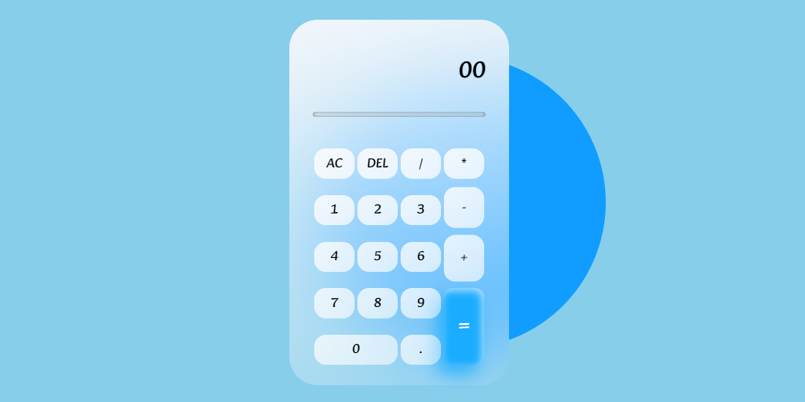

# Calculator by Samiran

🧮 Welcome to the Calculator project by Samiran! Perform basic mathematical operations with ease using this simple yet powerful calculator built with HTML, CSS, and JavaScript.

## Table of Contents

- [Introduction](#introduction)
- [Features](#features)
- [How to Use](#how-to-use)
- [Demo](#demo)
- [Contribution](#contribution)
- [License](#license)

## Introduction

Calculator by Samiran is a user-friendly calculator that allows you to perform addition, subtraction, multiplication, and division. Whether you're a student, professional, or anyone in need of quick calculations, this calculator has got you covered.

## Features

- ➕ Addition
- ➖ Subtraction
- ✖️ Multiplication
- ➗ Division

## How to Use

1. Visit the calculator site: [Calculator by Samiran](https://samiran845.github.io/Calculator-By-Samiran/).
2. Use the on-screen buttons or your keyboard to input numbers and operators.
3. Click the "=" button to see the result of your calculation.
4. Clear the input with the "C" button if you need to start fresh.

## Demo

Check out the live demo of the Calculator [here](https://samiran845.github.io/Calculator-By-Samiran/).

## Contribution

Contributions are always welcome! If you have suggestions for improvements, new features, or find any issues, please open an issue or submit a pull request. Let's make this calculator even more efficient and user-friendly together.

## License

Feel free to use, modify, and share the calculator for your mathematical needs.

---

Make your calculations a breeze with the Calculator by Samiran! 🧮✨